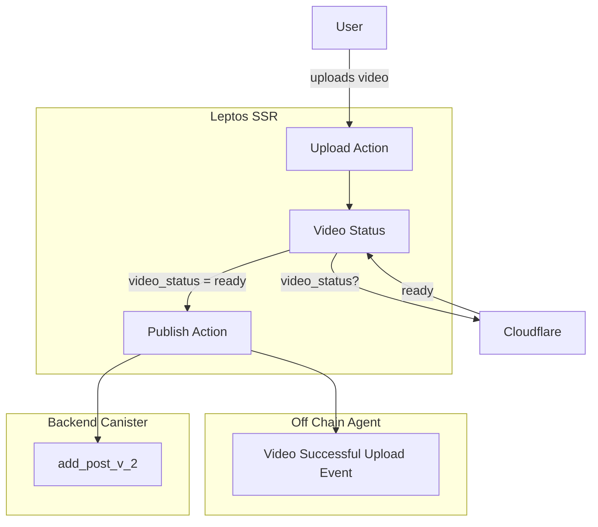
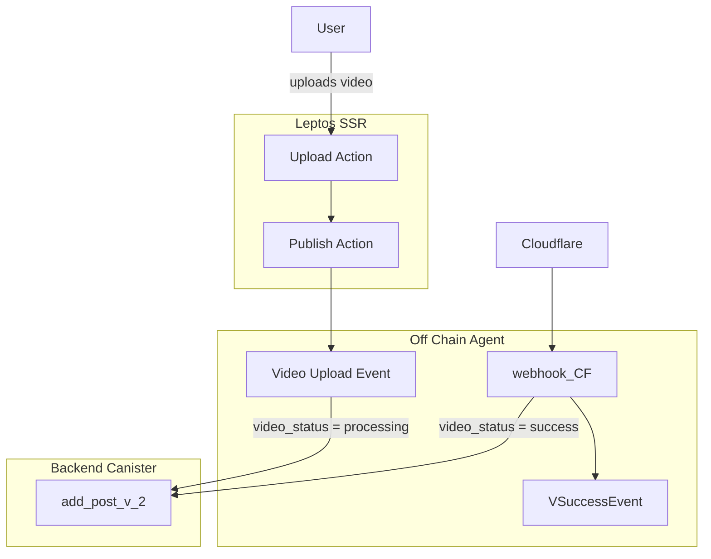

Current: Video Upload Process

```mermaid
flowchart 

    User[User]
    subgraph LeptosSSR[Leptos SSR]
        UploadAction[Upload Action]
        PublishAction[Publish Action]
        VideoStatus[Video Status]

    end
    CFStatus[Cloudflare]
    VSuccessEvent[Video Successful Upload Event]

    User -- uploads video --> UploadAction 

    UploadAction --> VideoStatus
    CFStatus -- ready --> VideoStatus
    VideoStatus -- video_status = ready --> PublishAction
    PublishAction --> VSuccessEvent
    PublishAction --> add_post_v_2
    VideoStatus -- video_status? --> CFStatus

    subgraph OffChainAgent[Off Chain Agent]
        VSuccessEvent
    end

    subgraph BackendCanister[Backend Canister]
        add_post_v_2
    end
```

Proposed Changes: Video Upload Process

```mermaid
flowchart 

    User[User]
    subgraph LeptosSSR[Leptos SSR]
        UploadAction[Upload Action]
        PublishAction[Publish Action]

    end
    CFStatus[Cloudflare]
    VEvent[Video Upload Event]

    User -- uploads video --> UploadAction 

    UploadAction --> PublishAction
    PublishAction --> VEvent

    subgraph OffChainAgent[Off Chain Agent]
        webhook_CF --> VSuccessEvent
        VEvent
    end

    CFStatus --> webhook_CF

    VEvent -- video_status = processing --> add_post_v_2
    webhook_CF -- video_status = success --> add_post_v_2

    subgraph BackendCanister[Backend Canister]
        add_post_v_2
    end

```

 

